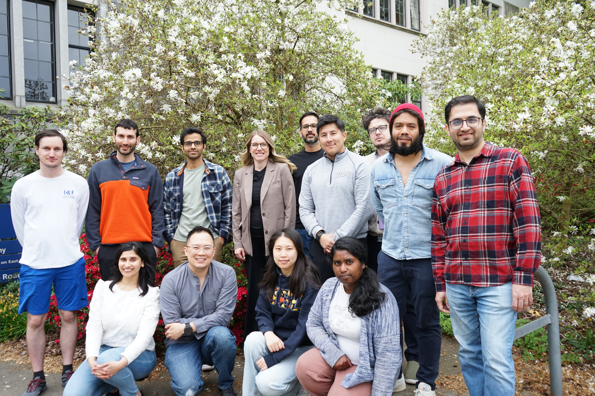

Courses in the UBC Master of Data Science - Vancouver program are primarily taught by our core teaching team. The team is in constant communication to share ideas, support each other, and collaboratively build the best program we can. These are the faces that you will be seeing every day throughout the MDS program.

## Team Stats

- **13** : The total number of different languages we speak (including Cantonese, Farsi, Hindi, Japanese, Malayalam, Mandarin, Marathi, Nepali, Spanish, Swedish, and Vietnamese)
- **20** : The total number of coding languages we have experience working with as a whole.
- **10** : The number of different countries our team cheers for during the Olympics.
- **5.7** : The average number of years our team has of teaching experience (with a standard deviation of 3.2).
- **10** : The median number of postsecondary education years our team has studied.

## Team Facts

- The team often uses <a href="https://www.bitmoji.com/" target="_blank">Bitmojis</a> to communicate with one another.
- The team is an assortment of morning birds (early risers) and night owls (late sleepers).
- We have a teamwork contract that promotes a respectful and transparent work environment.
- We hold weekly team meetings where we discuss not only our work progress but also our social wellbeing (this was implemented during COVID when we were working from home and we decided to keep it).

## The Team

  

    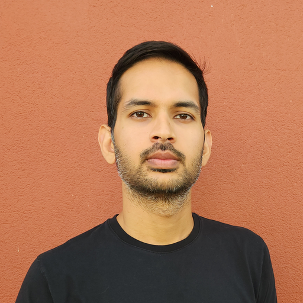
  

  

    <h4 style="margin-top: 0;">Prajeet Bajpai, Postdoctoral Research and Teaching Fellow</h4>
    

      Prajeet received his Master's and PhD in Mathematics at the University of British Columbia and his Bachelor's degree at Dartmouth College. As a PhD student, he had the opportunity to work as a TA for MDS, and joined the program full-time as a Postdoctoral Teaching and Learning Fellow in 2024.
        
      <i>Prajeet likes to play tennis (and occasionally the guitar) and loves to cook and eat.</i>
        
      <a href="https://p-bajpai.github.io" target="_blank">Learn more about Prajeet here.</a>
    

  

  

    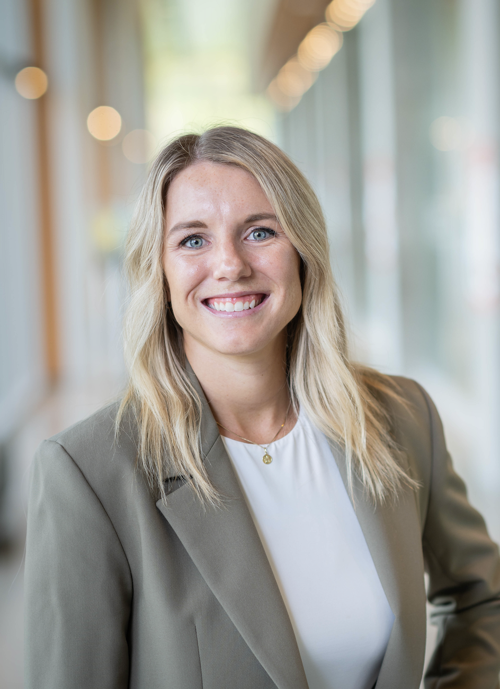
  

  

    <h4 style="margin-top: 0;">Katie Burak, Assistant Professor of Teaching (On leave)</h4>
    

      Katie joined UBC and began her role with MDS in July 2023. She completed her PhD in Statistics at the University of Alberta where her academic work focused on increasing the computational efficiency of nonparametric approaches such as bootstrapping using concentration of measure. She has previously organized a variety of outreach events such as data science camps and has a passion for statistical education and community outreach. When Katie is not teaching, you can find her hiking, skiing or playing tennis.
        
      <i>In the last 6 months, Katie has learned how incredible the trails are in Pacific Spirit Park.</i>
        
      <i>Katie's favourite data science topics involve the applications of statistics, such as modelling and statistical inference.</i>
        
      <a href="https://katieburak.github.io/" target="_blank">Learn more about Katie here.</a>
    

  

  

    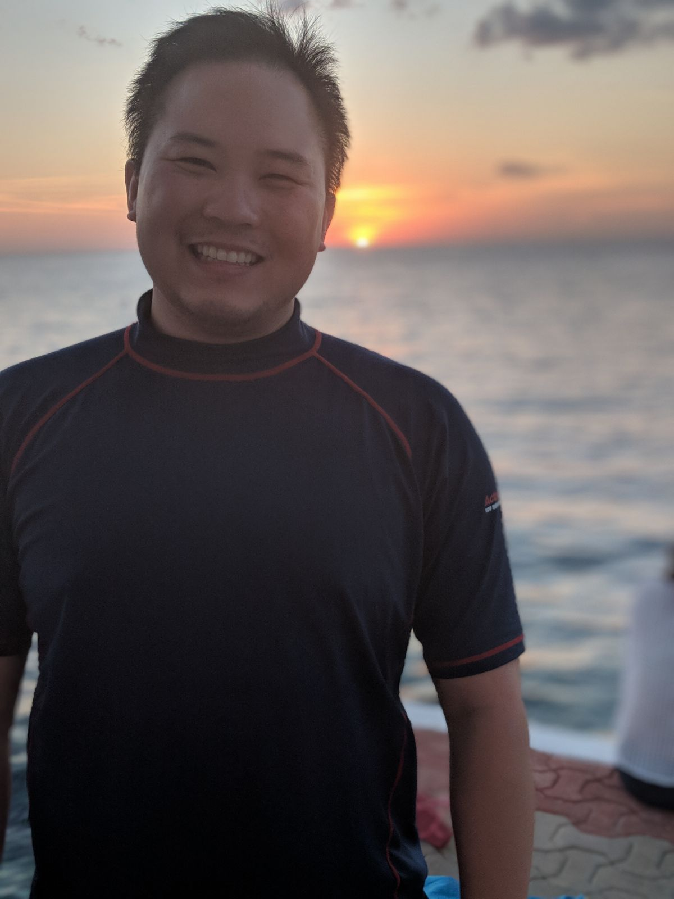
  

  

    <h4 style="margin-top: 0;">Daniel Chen, Lecturer</h4>
    

      Daniel Chen joined the MDS program in March 2022. They were born and raised in New York City where they also got their BA in Psychology and Behavioral Neuroscience (Macaulay Honors College at CUNY Hunter College), and a MPH in Epidemiology (Columbia University). They left the city life for rural Southwest Virginia to do their PhD in data science education in the biomedical sciences (Virginia Tech). Vancouver hopes to combine the bustling life of a city with the peacefulness of the great outdoors.
        
      Daniel hopes to bring his experiences with communities of practice (The Carpentries) and industry (Consulting and RStudio) to teach and inspire the next generation of data scientists make the world a better place.
        
      When Daniel is not teaching you can find him in the tranquil world of underwater caves, on top of the world with a snowboard, or at a computer learning how to CAD design something to print on his 3D printer.
        
      <i>In the last 6 months, Daniel learned how to use a lathe and mill to make a lightsaber!</i>
        
      <i>Daniel's favorite data science topic are reproducible and collaborative workflows.</i>
        
      <a href="https://daniel.rbind.io/" target="_blank">Learn more about Daniel here.</a>
    

  

  

    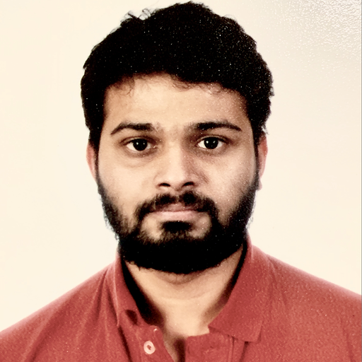
  

  

    <h4 style="margin-top: 0;">Gittu George, Lecturer</h4>
    

      Gittu George became a part of the MDS team in the spring of 2021. He graduated with a Bachelors of Computer Science from Mahatma Gandhi University and completed a Master of Science from the University of Houston in the same field but specializing in Big Data Analytics. He furthered his education in the field of Bioinformatics by obtaining a PhD from the University of Dundee. In his research he explored new ways of visualizing GWAS across multiple phenotypes by creating a 3D ‘landscape'.
        
      <a href="https://www.linkedin.com/in/georgegit/" target="_blank">Learn more about Gittu here.</a>
    

  

  

    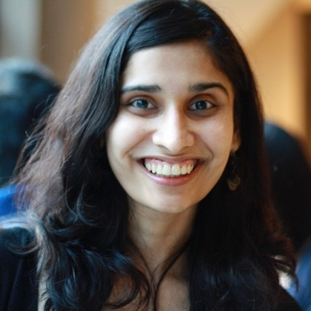
  

  

    <h4 style="margin-top: 0;">Varada Kolhatkar, Co-Director and Associate Professor of Teaching</h4>
    

      Varada Kolhatkar became a part of the MDS program in October 2018, serving as a teaching postdoctoral fellow. During this period, she discovered her passion for teaching, leading her to choose teaching and learning as her long-term career path. In July 2020, she transitioned into the role of an Assistant Professor of Teaching within the Department of Computer Science. Varada's academic journey includes a Master's degree from the University of Minnesota Duluth and a Ph.D. from the University of Toronto, both in Computer Science with a specialization in Computational Linguistics.
        
      <i>Varada has recently finished a 10-day meditation course during which she learned about <a href="https://www.dhamma.org/en-US/index" target="_blank">Vipassana meditation</a>. She is fascinated by the technique and aspires to deepen her understanding and practice.</i>
        
      <i>Varada’s favourite data science topic is unsupervised learning.</i>
        
      <a href="https://kvarada.github.io/" target="_blank">Learn more about Varada here.</a>
    

  

  

    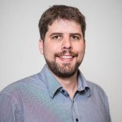
  

  

    <h4 style="margin-top: 0;">Rodolfo Lourenzutti, Co-Director and Associate Professor of Teaching</h4>
    

      Rodolfo joined MDS in 2018 as a Teaching Postdoctoral Fellow. After learning about teaching methods, Rodolfo joined the Department of Statistics as Assistant Prof. of Teaching in July 2020. At the time he stopped teaching at MDS, he continued to get involved occasionally, either mentoring Capstone projects or serving as Acting Co-Director of the program. Rodolfo got his BSc and Master's in Statistic and PhD in Computer Sciences, all in Brazil. During his PhD, he spent a year in the Department of Electrical and Computer Engineering at the University of Alberta, where he later joined as a postdoctoral fellow in the Department of Civil Engineering. Rodolfo loves interdisciplinary projects and enjoys asking questions to gain insight from data.
        
      <i>Rodolfo enjoys following political news and video games -- although he barely plays anymore. He played StarCraft Brood War for several years and tried to learn League of Legends (unsuccessfully).</i>
    

  

  

    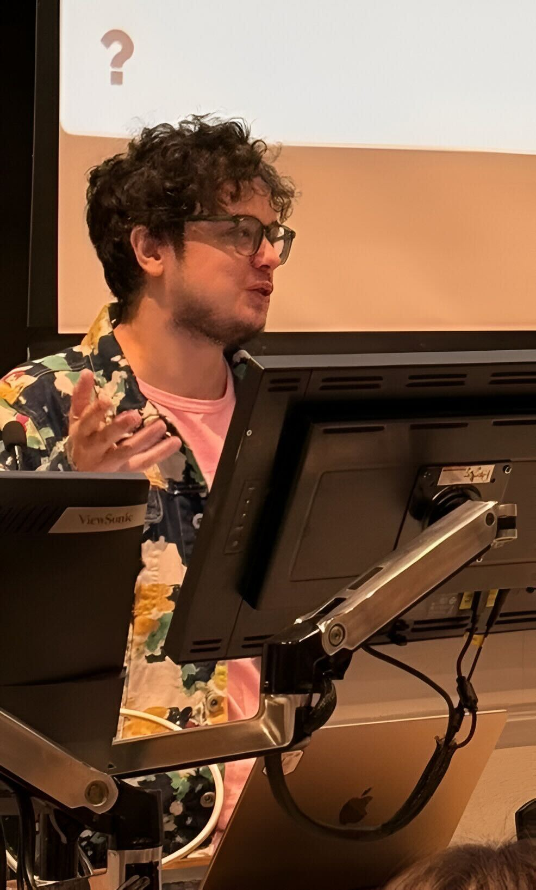
  

  

    <h4 style="margin-top: 0;">Ilya Musabirov, Assistant Professor of Teaching</h4>
    

      Ilya combines interests and research in human-centered data science, education, and different aspects of team collaboration and communication. His doctoral work at UofT focused on building ML-enabled platforms that make educational and behavioral interventions adaptive, and developing tools for data-driven decision-making that rely on computational interaction methods—Bayesian models, multi-armed bandits, data visualization, and optimization.
        
      Before coming to Toronto, he spent eight years designing data science and computer science courses, with a particular focus on students not majoring in STEM fields. More broadly, he is interested in how we teach computer and data science, including to students outside typical STEM fields, and how machine learning can improve different aspects of human experience.
        
      <a href="https://www.linkedin.com/in/musabirov/" target="_blank">Learn more about Ilya here.</a>
    

  

  

    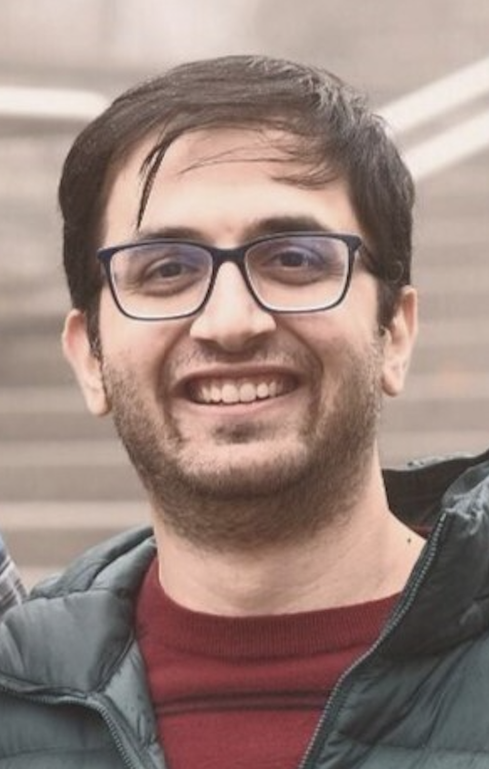
  

  

    <h4 style="margin-top: 0;">Payman Nickchi, Postdoctoral Research and Teaching Fellow</h4>
    

      Payman began his role as a Postdoctoral Research and Teaching Fellow at UBC in September 2024. Earlier that year, in February, he completed his PhD in Statistics at Simon Fraser University, where his research focused on biostatistics and goodness-of-fit tests using empirical distribution functions. Before that, he earned a bachelor's degree in mathematical statistics and a master's degree in statistics from the University of Tehran. His passion for statistics, teaching, and data science brought him to this role. Outside of work, Payman enjoys swimming and capturing the night sky through astrophotography.
        
      <i>I like to take photo from night sky, a hobby known as astrophotography.</i>
        
      <a href="https://pnickchi.github.io/" target="_blank">Learn more about Payman here.</a>
    

  

  

    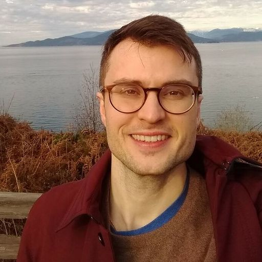
  

  

    <h4 style="margin-top: 0;">Joel Östblom, Assistant Professor of Teaching</h4>
    

      Joel began his involvement with MDS as a TA while working on his PhD and joined as his current position, in the Summer of 2020. During his PhD, Joel developed a passion for data science and reproducibility through the development of quantitative image analysis pipelines for studying stem cell and developmental biology. He has since co-created or lead the development of several courses and workshops at the University of Toronto and the University of British Columbia. Joel cares deeply about spreading data literacy and excitement over programmatic data analysis, which is reflected in his contributions to open source projects and data science learning resources. Outside of the classroom, Joel can be found playing soccer, hockey, hiking or on the beach.
        
      <i>In the last 6 months, Joel has learned the beginnings of meditation.</i>
        
      <i>Joel's favourite data science topics are visualization, ethics and clustering.</i>
        
      <a href="https://joelostblom.com/" target="_blank">Learn more about Joel here.</a>
    

  

  

    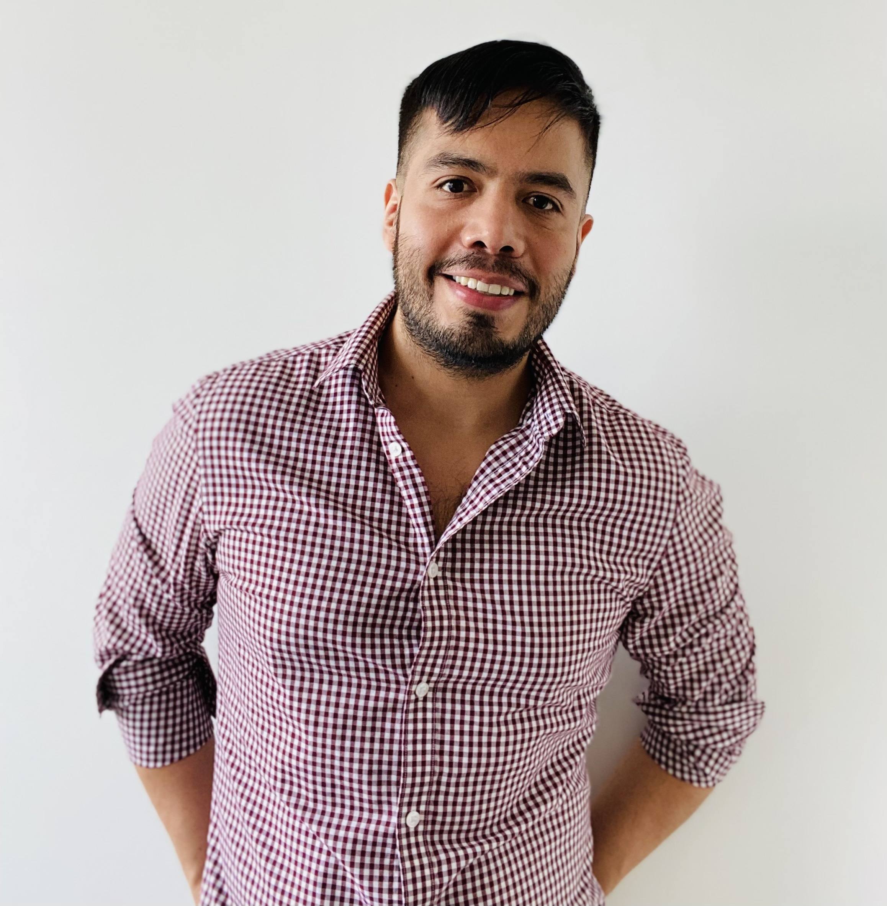
  

  

    <h4 style="margin-top: 0;">Alexi Rodríguez-Arelis, Assistant Professor of Teaching</h4>
    

      Alexi commenced his current role at MDS in January 2021. He completed his PhD in Statistics at the University of British Columbia in 2020. Born and raised in Mexico, he pursued an undergraduate degree in Industrial Engineering and a master's degree in Applied Statistics at Tecnológico de Monterrey. His machine learning research focuses on computer experiments that emulate scientific and engineering systems via Gaussian stochastic processes. Moreover, he has professional experience in the financial sector along with statistical consulting. When Alexi is not working and teaching, he can be found swimming, trying out new restaurants, or exercising.
        
      <i>In the last 6 months, Alexi has learned about the many different ways that machine learning and statistics are connected.</i>
        
      <i>Alexi's favourite data science topics are those involving statistics, specifically, inferential tools.</i>
        
      <a href="https://alexrod.netlify.app/" target="_blank">Learn more about Alexi here.</a>
    

  

  

    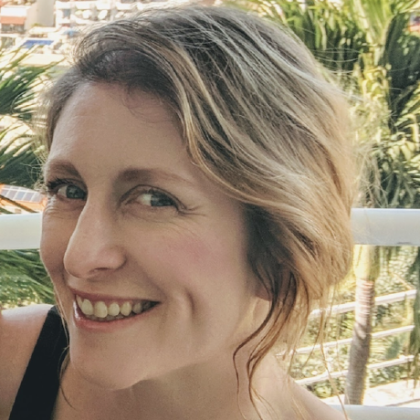
  

  

    <h4 style="margin-top: 0;">Tiffany Timbers, Associate Professor of Teaching</h4>
    

      Tiffany joined the founding team who developed the Master’s of Data Science program at UBC as a Postdoctoral Teaching and Learning Fellow. She received a PhD in Neuroscience in 2012 from UBC, following which she held a Banting Postdoctoral Fellowship at Simon Fraser University where her research focused on cell biology & genomics. This postdoctoral research was data intensive and required the application of data science and statistical methodologies. In 2018, she joined the Statistics Department at UBC as an Assistant Professor of Teaching. She primarily teaches courses on introductory statistics and data science, computer programming, reproducible workflows and collaborative software development.
        
      <i>Tiffany's favourite data science topics are reproducibility and software development.</i>
        
      <a href="https://tiffanytimbers.com/" target="_blank">Learn more about Tiffany here.</a>
    

  

  

    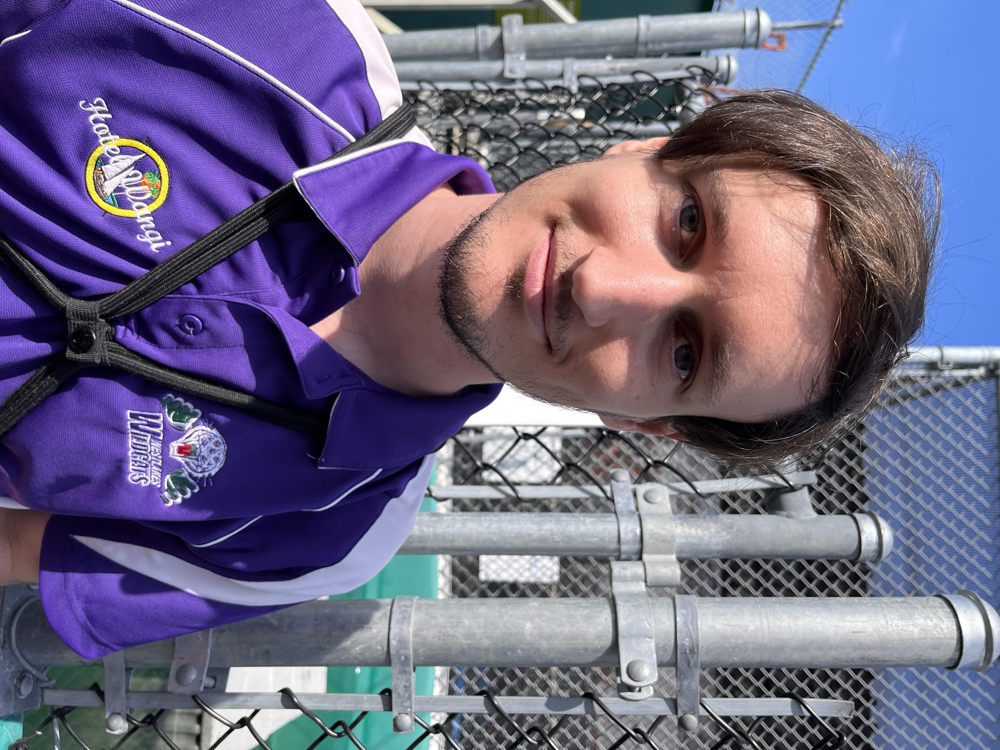
  

  

    <h4 style="margin-top: 0;">Zac Warham, Course Coordinator</h4>
    

      Zac moved to Canada from Australia in August of 2021 and joined the MDS team in January 2022 as a TA whilst studying his Masters of Science in Oceans and Fisheries at UBC. Prior to his time at UBC, Zac worked as an IT Support Assistant and an Aquarium Aquarist whilst he studied a combination of Marine Biology & Web Development. Outside of the classroom, Zac can be found volunteering at the Marine Mammal Rescue Centre or playing pool and games.
        
      <i>Zac's favourite part of data science is developing dashboards (usually Shiny Apps) to make scientific data more accessible to the public.</i>
        
      <a href="https://www.linkedin.com/in/zacwarham/" target="_blank">Learn more about Zac here.</a>
    

  

  

    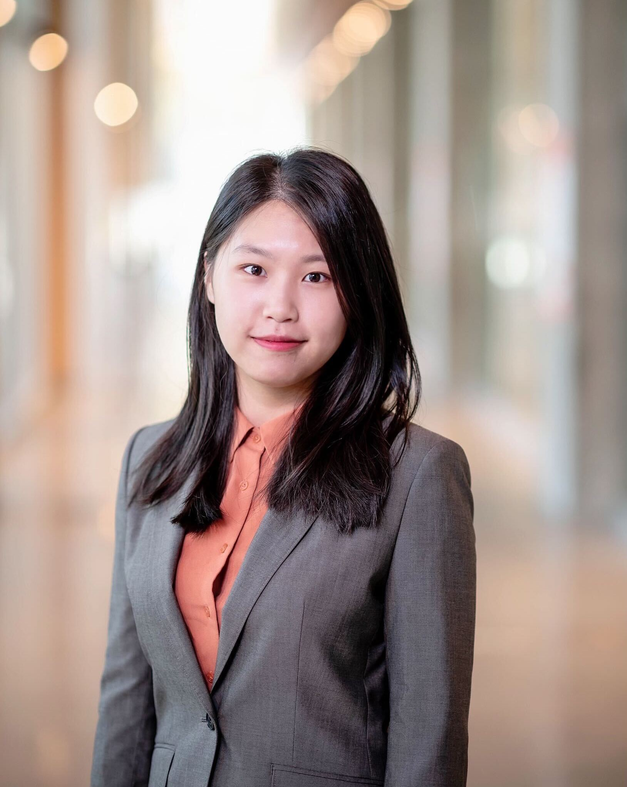
  

  

    <h4 style="margin-top: 0;">Betty Zhao, Course Coordinator</h4>
    

      Betty Zhao joined the MDS program in January 2022 as a course coordinator. She was born in Johannesburg but grew up in Shanghai. She has also lived in Gaborone for six years before coming to Vancouver. She pursued her undergraduate degree in combined major Business and Computer Science at the University of British Columbia. When Betty is not working, you can find her exploring new food, watching anime, or playing games.
        
      <a href="https://www.linkedin.com/in/mengxinzhao/" target="_blank">Learn more about Betty here.</a>
    

  

## Past Team Members

- **Tomas Beuzen** (Now Data Scientist at Solar Analytics)
- **Ben Chen** (Course Coordinator)
- **Vincenzo Coia** (Now Senior Data Scientist I at BGC Engineering Inc.)
- **Giulio Valentino Dalla Riva** (Now Senior Lecturer in Data Science at University of Canterbury)
- **Florencia D'Andrea** (Now Contractor - Data Analyst/Research Software Engineer at Washington State university)
- **Mike Gelbart** (Now Co-Founder and Principal of [VISST](https://www.visst.ca/#team))
- **Vincent Liu** (Now Machine Learning Researcher at RBC Borealis)
- **Firas Moosvi** (Now Lecturer in the Computer Science, Mathematics, Physics, and Statistics department at UBC Okanagan)
- **Quan Nguyen** (Now Assistant Professor in the Computer Science department at Thompson River University)
- **Arman Seyed-Ahmadi** (Now Research Scientist at Genentech)
- **Shaun Sun** (Now Assistant Professor in the Department of Mathematics and Statistics at University of the Fraser Valley)
- **Andy Tai** (Now Postdoctoral researcher at IKIM - Institute for Artificial Intelligence in Medicine)
- **Hedayat Zarkoob** (Now Lecturer at Simon Fraser University)
