### Table of Contents
- [Before your Quiz](#before-your-quiz)
   - [Reservations](#making-a-quiz-reservation)
   - [Cheatsheets](#creating-a-cheatsheet)
- [During your Quiz](#during-the-quiz)
- [After your Quiz](#after-your-quiz)
- [Alumni Cheatsheet Tips](#alumni-advice)

---

## Before Your Quiz

### Making a Reservation

The following instructions apply to both quiz and quiz review reservations. You **must make a separate reservation for each quiz**, but only one quiz review reservation is required to review all quizzes from the previous week. Please make your reservations early, as availability is limited and time slots may fill up quickly.

- Open [PrairieTest](https://us.prairietest.com/)
- Click Login and select University of British Columbia (ubc.ca)
- Log in with your CWL
- Accept the invitation to join `MDS 5XX`
  - You only need to do this once per term, and please contact the course coordinators if you have issues viewing the invitation.
- Follow [ORCA's video tutorial](https://cbtf.ubc.ca/students/reservations) to make reservations
  - You only need the first ~5 minutes of this video as we utilise self-assigned reservations in MDS.
- All your future reservations will be displayed under Exam reservations

### Creating a Cheatsheet

When indicated by the instructor, students are allowed to use digital cheatsheets, which must be uploaded to PrairieLearn. We trust that you will adhere to the guidelines when submitting your digital cheatsheets. Should we spot an "unreasonable" digital cheatsheet, we may request the **corresponding printed physical cheatsheet.** If it is deemed excessively unfair compared to others, penalties may be applied. The cheatsheet must be:

- **Requirements:** Confined to a **single, one-sided piece of letter-sized paper, 8.5 by 11 inches.** Please **do not** use legal or A4-sized paper
  - Letter-sized paper will be available in the labs if needed
- **Content format:** You may handwrite, type, or digitally create your cheatsheet, ensuring all information is **clearly readable when printed on letter-sized paper**
  - If you're typing your cheatsheet, ensure you use a minimum font size of 8 pt
  - Photos and screenshots from lecture material are allowed on the cheatsheet as long as it fits all other criteria
- **Submission format:** The cheatsheet must be submitted as a **PNG file** with a file size of **5 MB or less.** This file size limit is enforced by PrairieLearn
  - You can create the PNG by scanning, photographing, or taking a screenshot of your cheatsheet
- **Resizing tools:** You can use Paint on Windows and Preview on Mac for basic resizing. Check out [ImageMagick](https://imagemagick.org/index.php) for more detailed adjustments such as resizing or format conversion, if needed
- **Naming convention:** File names of your digital cheatsheets should correspond with course names to avoid confusion
  - The file name for the 521 cheatsheet should be similar to `521_quiz_2_cheatsheet.png`
  - Please verify the **exact name** upon submission
- **Deadline:** digital cheatsheets are **due by 11:59 p.m.** the night before the quiz window opens
  - This is typically Monday night unless instructed otherwise
- **If a cheatsheet is found to be "unreasonable", i.e., the cheatsheet is not readable when printed on a letter-sized paper, you may be called in for a discussion and could face penalties**

Please remember that the primary goal is to understand the course material, not just to optimize your cheatsheets. Focusing on the concepts rather than the cheatsheet format will be far more beneficial for your quizzes and overall learning in the long run. One of our alumni has provided some [tips for creating the cheatsheet](#tips-for-creating-a-cheatsheet) to assist your learning.

### Submitting a Cheatsheet

**Note**: Please use **Chrome** or **Firefox** to upload your cheatsheet. Other browsers may not work. If you haven’t installed these browsers, please refer to the [installation guide](https://ubc-mds.github.io/resources_pages/installation_instructions/) for instructions.

1. Log in to PrairieLearn and navigate to the course where you need to upload your cheatsheet.

    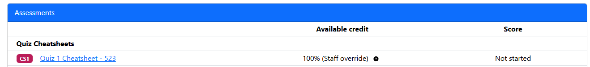

2. Select the "Cheatsheet" assessment and open the corresponding upload question.

    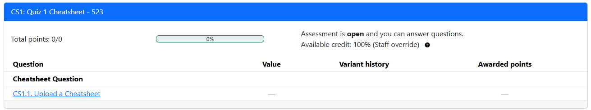

    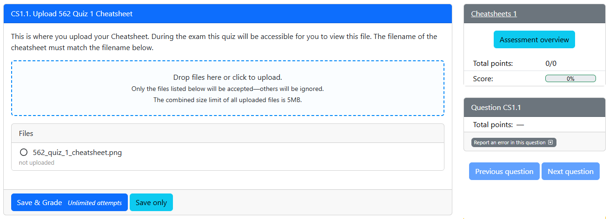

3. Upload your cheatsheet, ensuring it meets the cheatsheet [requirements](#creating-a-cheatsheet).

    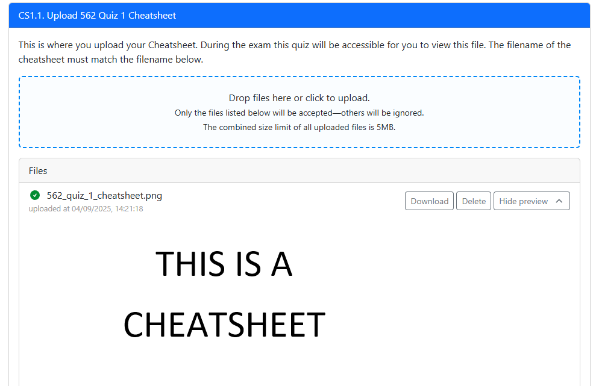

4. Click `Save & Grade` to submit your file.

    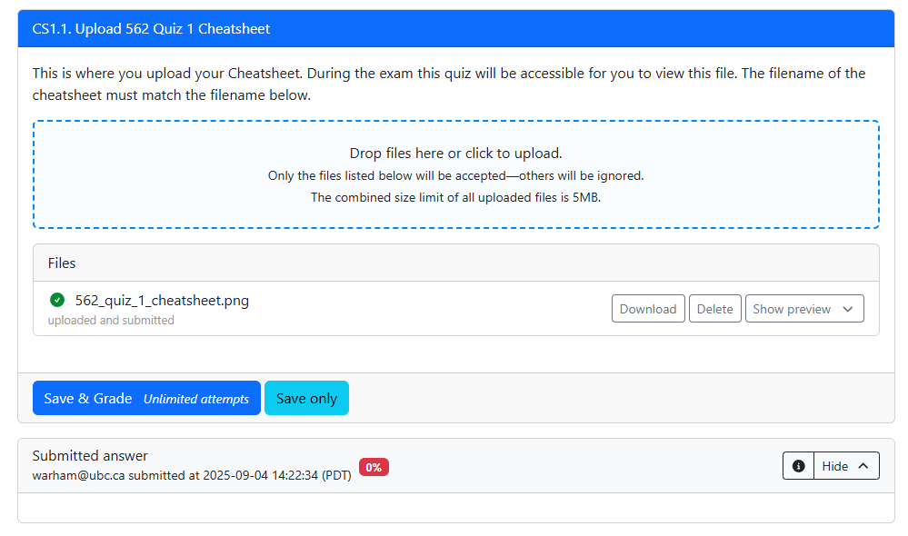

5. Once uploaded, you should see a preview of your PNG on PrairieLearn. You can update and re-upload your cheatsheet as many times as needed before the deadline.

6. Double-check that you have uploaded the cheatsheet to the **correct** course.
**NOTE: YOU MUST BE ABLE TO SEE YOUR CHEATSHEET HERE BY CLICKING 'SHOW PREVIEW' - IF YOU CANNOT SEE IT, IT WILL NOT WORK IN THE QUIZ**

---

## Taking a Quiz

You can find further information on the [ORCA/CBTF website](https://cbtf.ubc.ca/students/procedures)

### Check in the quiz room

1. Arrive at the quiz room listed on your reservation at least **10 minutes** before the quiz starts.
2. Upon entering the exam room, do **not** communicate with anyone other than the invigilators.
3. To check in, wait until the card reader displays a **red** light, then tap your student card. If your reservation is found, the invigilator will tell you your assigned seat number.
4. Place all personal belongings and electronic devices on the racks at the front of the room (phones, bags, hats, jackets, smartwatches/glasses, etc.). Phones must be turned off or on airplane mode. Physical calculators are also not permitted (a digital one will be available on the computer).
  - Note: Scrap paper and pens will be provided in the exam room.
5. Find your assigned seat and log into the computer using the username and password displayed on the whiteboard or wall.
6. Use **Microsoft Edge** to open **PrairieTest**.
7. Log in using your CWL and password.
  - Raise your hand if you need your electronic device for two-step verification.
8. Navigate to the quiz page, and wait for further instructions.

### During the Quiz

- Once the invigilator announces the start of the exam, both the quiz link and the cheatsheet link (if applicable) will appear on PrairieTest. Refresh the page if the links do not show up.
  - **Note**: If the cheatsheet link does not work due to a known bug, you can access it by going to `Assessments` → Cheatsheet assignment. See the step-by-step instructions [below](#cheatsheet-link)

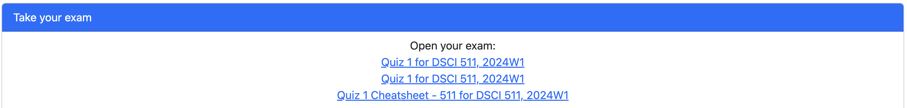

- You have 50 minutes to complete all questions. A countdown timer will display the remaining time, and the quiz will automatically submit when the timer reaches zero.
- **Make sure to save each question. If you do not click Save you will not be graded for that question!**
- If you need to use the washroom, raise your hand and notify the invigilator. Leave only if permitted. We recommend using the washroom before the quiz starts.
- After submitting your exam, close your browser, hand in any scrap paper, and exit the room quietly to avoid disturbing others.

#### Cheatsheet Link

If you click on the cheatsheet link and it shows `Assessment is no longer available`. **Don't stress!**

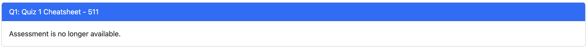

- Click on `Assessment` on the top.

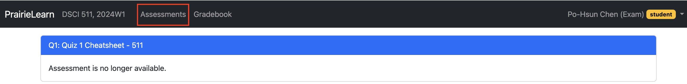

- Click on the `cheatsheet` assessment.

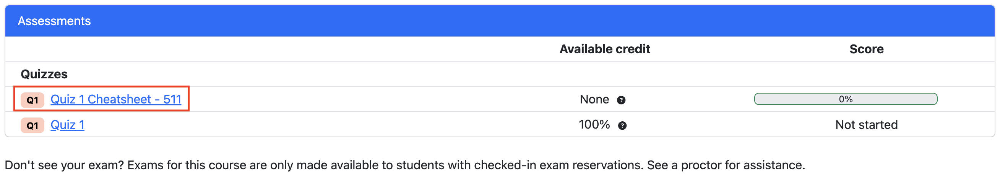

- Click on the `cheatsheet` question.

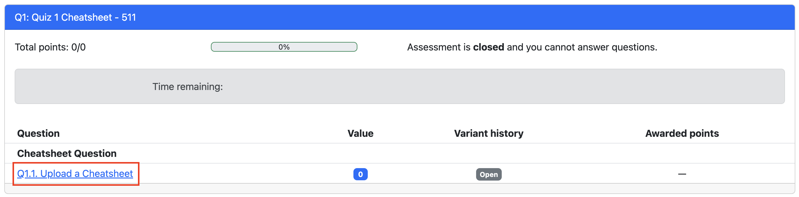

- Click `preview`.

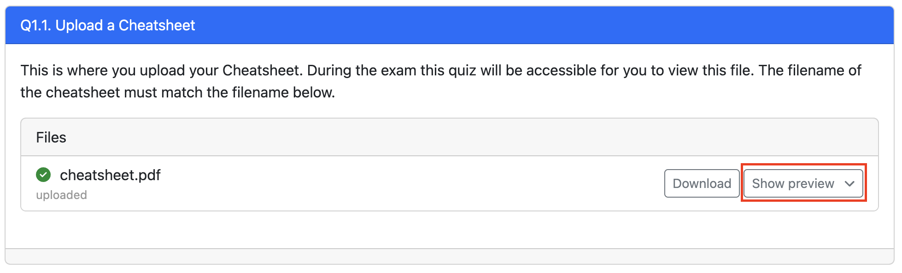

- **Note**: If the preview doesn't load properly, refresh the browswer or download the cheatsheet.

---

## After Your Quiz

### Quiz Results Review Session

During the review session, you will have access to the results of all quizzes from the previous week. You may also submit regrade requests at this time by clicking on `Report an issue with this question` (to the right of the question) and describing the your regrade request. Please read the [reasonable regrading request policy](https://ubc-mds.github.io/policies/#reasonable-grading-concerns) beforehand.

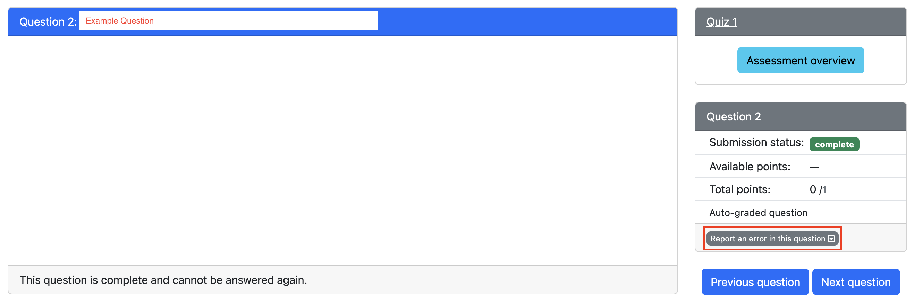

Please note that, similar to quiz sessions, no notes or external materials are permitted during the review of your grades.

---

## Alumni Advice

Whilst there are many approaches to creating a cheatsheet, one of our alumni Stephanie Ta, has offerred up the following tips for how they created their cheatsheets. Feel free to take a look below, including a copy of of their 571 cheatsheet which is to be used as an example only.

### Tips for Creating a Cheatsheet

- I used MS PowerPoint to make mine (the page size can be changed to be letter sized), exported them to PDF, then used an online [PDF to PNG converter](https://pdf2png.com/). This gives a very high resolution result, as opposed to saving the PowerPoint to PNG directly.
- In my notes, my equations were made using latex, and equations can be easily copied in latex from the GitHub textbooks. However, I could not copy those directly into my PowerPoint cheatsheet. Instead, I had to copy it into MS Word which converted the latex into a readable equation, then I copied that equation to PowerPoint. (I preferred to do this over adding images since the resolution would be better, I could modify the equations if needed, and I knew the font size would follow guidelines)
- I based my cheatsheets off of the learning objectives.
- Boxes separate lectures or bigger concepts. Generally, key words are in blue, code is in dark red, and examples are in green.

### Example Cheatsheet

*This cheatsheet is kindly shared by one of our amazing alums, Stephanie Ta. Its main purpose is to help you understand the format of a cheatsheet. We have not verified the content. Please do not plagiarize. The whole point of creating your own cheatsheet is that it supports your learning and retention of information.*

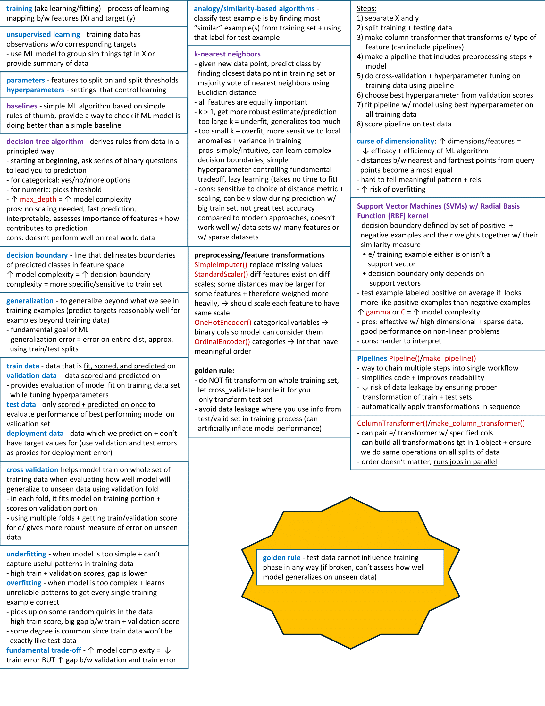
