## Everything MDS Quiz Related

### Table of Contents
- [Overview of MDS Quizzes](#overview)
- [Before your Quiz](#before-your-quiz)
   - [Reservations](#making-a-quiz-reservation)
   - [Cheatsheets](#creating-a-cheatsheet)
- [During your Quiz](#during-the-quiz)
- [After your Quiz](#after-your-quiz)
- [Alumni Cheatsheet Tips](#alumni-advice)

---

### Overview

With the exception of project courses, MDS courses will have two quizzes throughout the block, typically one in the middle of the course and another after the course ends during the free days between blocks. Each quiz will last for 50 minutes and will be taken inside of the CBTF at UBC. You will also have the option to attend a review quiz session which allows you to look back at your quiz to see where you might have made mistakes. Please be sure to read through the [quiz policy](https://ubc-mds.github.io/policies/#quiz-policies) as well. The information in the quiz policy page has the final say in any discrepancies between the two pages.

The quizzes for a course will appear on the [MDS quizzes calendar](https://ubc-mds.github.io/calendar/) with a 'tentative' label for future quizzes. Once reservations open, we will update this to be 'confirmed' to lock in those dates. This is due to the fact that we must schedule exam availability around all other courses at UBC. We will do our best to keep the dates consistent throughout the program, provided the CBTF has adequate availability.

### Purpose

The purpose of quizzes are to be a "sanity check" that students are keeping up with the essential material. While labs may go more in-depth into a topic, the quizzes cover essential material that we expect students to have mastered and to retain.

### Difficulty

In light of the purpose above, quizzes are intended to be less difficult than the labs. They are not meant to trick you nor to contain unexpected material. In short, if you did the labs without an unreasonable amount of collaboration with your classmates, you should succeed on the quizzes.

### Quiz Format and Platform

Quizzes will be held on PrairieLearn, often referred to as 'PL' for short. Instead of quizzes being held at the same time for every student, we will provide quiz windows (available time slots) for students to register for their preferred time. Quizzes will feature randomized questions, so each student may receive a slightly different version of the quiz. Quizzes will be booked through the platform called PrairieTest (shortened to 'PT').

During the quiz window, students are **NOT** allowed to disclose, discuss, or share any part of the quiz with any other individual, except as directly permitted or required by the course instructors. This includes discussions in person, online, or through any electronic means. Violation of this policy will result in academic penalties, which may include failure of the quiz or failure of the course.

### What is a CBTF?

CBTF stands for 'Computer-Based Testing Facility' and is a series of purpose built computer labs on campus for taking exams at UBC. You can find more information about the CBTF such as location on campus and scheduling through their [website](https://cbtf.ubc.ca/). We will refer you to this website at various points in this document.

---

## Before Your Quiz

### Overview

Here is a timeline and order of operations of what to look out for leading up to your quizzes.

1. 2-3 weeks before each quiz, the course coordinators will receive the schedule from the CBTF
2. The calendar will be updated an announcement made when quizzes are ready to be booked
3. Students then log in to [PrairieTest](https://us.prairietest.com/) to book their sessions
4. Instructors will indicate what style of cheatsheet is to be used for this quiz
   - this chould be student created, instructor created, or no cheatsheet
5. If student created cheatsheets are to be used, create and submit this prior to the quiz window
   - everyone has the same deadline, regardless of which day your quiz reservation is

### Making a Quiz Reservation

You must complete the instruction below before writing quizzes. This is an essential step to check in the quiz room. The CBTF has provided a video tutorial on how to book quizzes. Please note, you only need the first ~5 minutes of this video as we utilise self-assigned reservations in MDS. You will also only have to accept the invitation once per term. **You must make a separate reservation for each quiz.**

You can access the video [here](https://cbtf.ubc.ca/students/reservations)

Here are some basic written instructions as well.

- Open [PrairieTest](https://us.prairietest.com/)
- Click Login and select University of British Columbia (ubc.ca)
- Log in with your CWL
- Accept the invitation to join MDS 5XX
  - You only need to do this once, and please DM the course coordinator if you have issues viewing the invitation.
- You will be able to book quizzes and view your booked quiz times and locations, under Exam reservations.
- Follow the instructions [here](https://cbtf.ubc.ca/students/reservations) to make reservations.
- Please make reservations early, as the spots can run out

### Creating a Cheatsheet

When indicated by the instructor, students are allowed to use digital cheatsheets, which must be uploaded to the PrairieLearn system. We trust that you will adhere to the guidelines when submitting your digital cheatsheets. Should we spot an "unreasonable" digital cheatsheet, we may request the **corresponding printed physical cheatsheet.** If it is deemed excessively unfair compared to others, penalties may be applied. The cheatsheet must be:

- **Requirements:** Confined to a **single, one-sided piece of letter-sized paper, 8.5 by 11 inches.** Please **do not** use legal or A4-sized paper
  - Letter-sized paper will be available in the labs if needed
- **Content format:** You may handwrite, type, or digitally create your cheatsheet, ensuring all information is **clearly readable when printed on letter-sized paper**
  - If you're typing your cheatsheet, ensure you use a minimum font size of 8 pt
  - Photos and screenshots from lecture material are allowed on the cheatsheet as long as it fits all other criteria
- **Submission format:** The cheatsheet must be submitted as a **PNG file (not PDF)** with a file size of **5 MB or less.** This file size limit is enforced by PrairieLearn, not by us
  - You can create the PNG by scanning, photographing, or taking a screenshot of your cheatsheet
- **Resizing tools:** You can use Paint on Windows and Preview on Mac for basic resizing. Check out [ImageMagick](https://imagemagick.org/index.php) for more detailed adjustments such as resizing or format conversion, if needed
- **Naming convention:** File names of your digital cheatsheets should correspond with course names to avoid confusion
  - The file name for the 521 cheatsheet should be similar to `521_quiz_2_cheatsheet.png`
  - Please verify the **exact name** upon submission
- **Deadline:** digital cheatsheets are **due by 11:59 p.m.** the night before the quiz window opens
  - This is typically Monday night unless instructed otherwise
- **If a cheatsheet is found to be "unreasonable", i.e., the cheatsheet is not readable when printed on a letter-sized paper, you may be called in for a discussion and could face penalties**

Please remember that the primary goal is to understand the course material, not just to optimize your cheatsheets. Focusing on the concepts rather than the cheatsheet format will be far more beneficial for your quizzes and overall learning in the long run.

### Submitting a Cheatsheet

**Note**: Please use **Chrome** or **Firefox** to upload your cheatsheet. Other browsers may not work. If you haven’t installed these browsers, please refer to the [installation guide](https://ubc-mds.github.io/resources_pages/installation_instructions/) for instructions.

1. Log in to PrairieLearn and navigate to the course where you need to upload your cheatsheet.

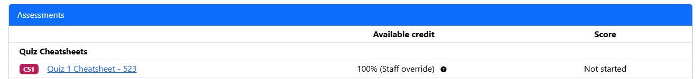

2. Select the "Cheatsheet" assessment and open the corresponding upload question.

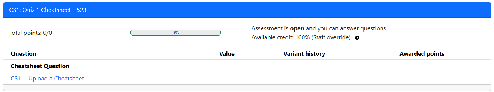

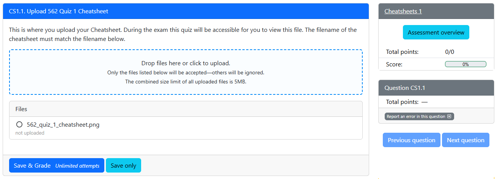

3. Upload your cheatsheet, ensuring it meets the cheatsheet [requirements](#creating-a-cheatsheet).

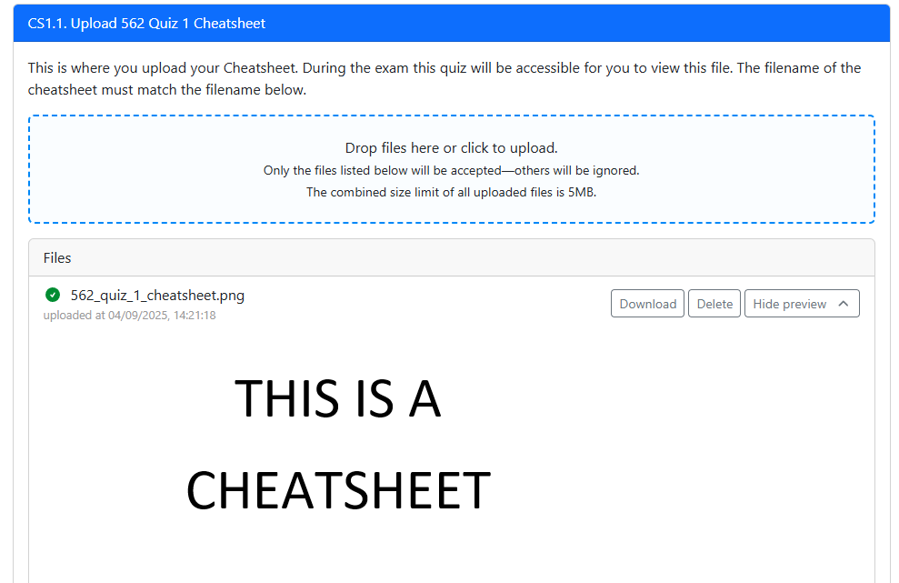

4. Click `Save & Grade` to submit your file.

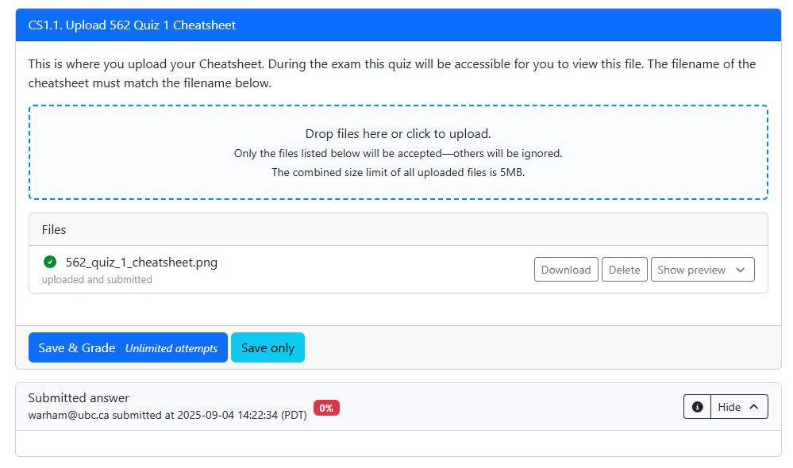

5. Once uploaded, you should see a preview of your PNG on PrairieLearn. You can update and re-upload your cheatsheet as many times as needed before the deadline.

6. Double-check that you have uploaded the cheatsheet to the **correct** course.
**NOTE: YOU MUST BE ABLE TO SEE YOUR CHEATSHEET HERE BY CLICKING 'SHOW PREVIEW' - IF YOU CANNOT SEE IT, IT WILL NOT WORK IN THE QUIZ**

---

## Taking A Quiz

We have tried to outline as much as possible below but you can also find further information on the [CBTF website](https://cbtf.ubc.ca/students/procedures)

### Quiz Logistics

- You must register in advance for a specific quiz time slot using PrairieTest. This will typically occur the week before quizzes.
- All MDS quizzes are closed-book and closed-internet, with the exception of the digital cheatsheet.
- Communication with anyone or any external resources during the quiz is strictly prohibited. For details, please visit our [Quiz policies](https://ubc-mds.github.io/policies/#quiz-policies) and [Plagiarism](https://ubc-mds.github.io/policies/#plagiarism) pages.
- You must attend your assigned quiz time and location. Failure to check in at the correct time and location may result in missing the quiz.
- When leaving the room after the quiz, please do so quietly to avoid disrupting others. Refrain from discussing the - quiz with anyone until everyone has completed it.

### Upon arriving at the quiz room

1. Attend your booked quiz sessions.
2. Be present at least **10 minutes** before the quiz starts.
3. Upon entering the exam room, do **not** communicate with anyone other than the invigilators.
4. An invigilator will check you in. Wait until the reader displays a **red** light before tapping your student card.
5. Place all personal belongings and electronics on the racks at the front of the room (phones, bags, hats, jackets, smartwatches, etc.). Phones must be turned off or on airplane mode. Physical calculators are also not permitted (a digital one will be provided on the computer).
   - Note: Your digital cheatsheet must follow the listed requirements in the [Creating a Cheatsheet](#creating-a-cheatsheet) section above, and scrap papers will be provided in the exam room.
6. Find your assigned seat number and log into the provided computer using the username and password displayed on the whiteboard or wall.
7. Use **Mircrosoft Edge** to open **PrairieTest**
8. Log in with your CWL.
9. Navigate to the quiz page, and wait for further instructions.
  - Ensure you open the correct quiz.

### During the Quiz

- You will have access to your digital cheatsheet during the quiz. Open PrairieTest, where you’ll find both the quiz link and the cheatsheet link.
  - **Note**: If the cheatsheet link doesn’t work due to a known bug, you can access it by going to `Assessments` → Cheatsheet assignment.
- You have 50 minutes to complete all questions. A countdown timer will display the remaining time, and the quiz will automatically submit when the timer reaches zero.
- After submitting your exam, close your browser, hand in any scrap paper, and exit the room quietly to avoid disturbing others.
- **Make sure to submit each question. If you do not click Save you will not be graded for that question!**

### Closed-book Policy

Unless otherwise specified, **quizzes will be closed-book** except for the digital cheatsheet. This means that during the quiz, students are expected to:

  - **Not** use the internet to solve quiz questions.
  - **Not** bring any materials that would assist in completing the quiz.
  - **Not** open any other files or webpages apart from the PrairieLearn quiz and the digital cheatsheet.
  - **Not** re-enter after leaving the quiz room (except for necessary reasons like using the washroom).

### No Collaboration

You may **not** communicate with other students or anyone else through any medium during the quiz. Communication with classmates is prohibited until all students have finished the quiz. There will be multiple quiz sessions, so please avoid discussing the quiz on Slack or elsewhere until the end of the final quiz session.

### Things to Bring/Remember

- **Student card**: Required for check-in and accessing the ICCS building after hours (after 5 pm).
- **Digital Cheatsheet**: Make sure your cheatsheet meets the [requirements](#creating-a-cheatsheet) and upload your digital cheatsheet to PrairieLearn before the quiz.
- **CWL password**: Memorize your password for logging into PrairieLearn.

### Special Circumstances

- **I finished the quiz early:**

  - Feel free to leave the quiz room quietly. You may not re-enter once you leave.
  
- **I need to use the washroom:**

  - Raise your hand and notify the invigilator. Leave only if permitted. We recommend using the washroom before the quiz starts.

### How to Access your Cheatsheet During the Quiz

After you open PrairieTest, you will see three links. Two links that direct to quiz itself and one link that directs to the cheatsheet. 

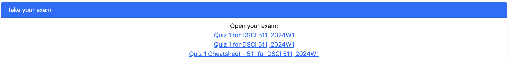

#### Quiz Link

Both quiz link will work so feel free to click on either one. 

#### Cheatsheet Link

If you click on the cheatsheet link and it shows `Assessment is no longer available`. **Don't stress!**

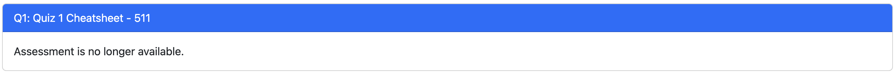

- Click on `Assessment` on the top.

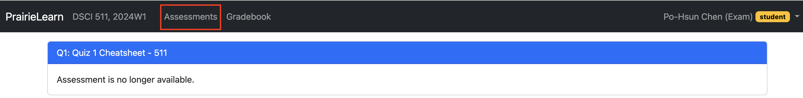

- Click on the `cheatsheet` assessment.

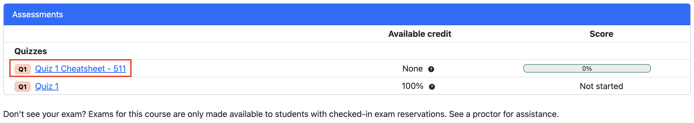

- Click on the `cheatsheet` question.

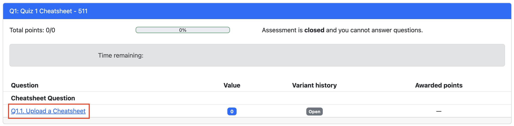

- Click `preview`.

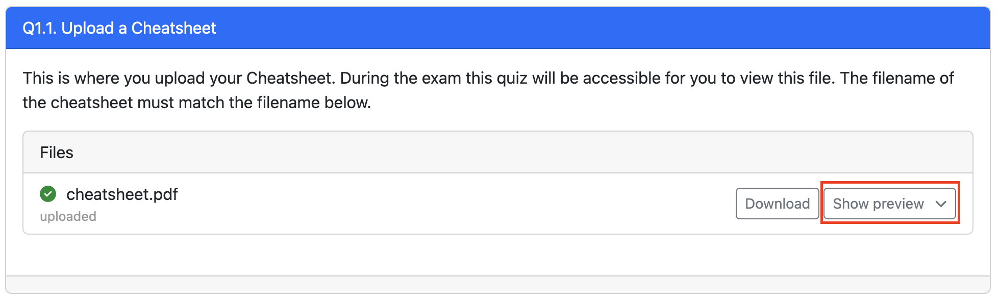

- **Note**: If the preview doesn't load properly, refresh the browswer or download the cheatsheet.

---

## After Your Quiz

### Quiz Results Review Session

To review your quiz results, you must register for a quiz review session on PrairieTest. These sessions will typically be available one week after the quiz, once all grading has been completed. Registration for the review session will follow the same process as registering for the quiz. During the review session, you will have access to the results of all quizzes from the previous week. You may also submit regrade requests at this time by clicking on `Report an issue with this question` (to the right of the question) and describing the your regrade request.

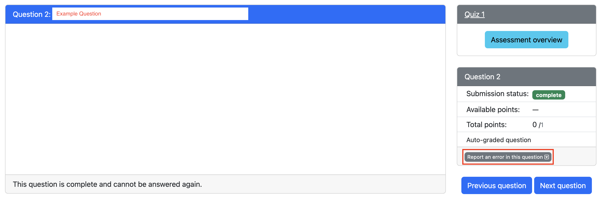

Please note that, similar to quiz sessions, no notes or external materials are permitted during the review of your grades.

---

## Alumni Advice

Whilst there are many approaches to creating a cheatsheet, one of our alumni Stephanie Ta, has offerred up the following tips for how they created their cheatsheets. Feel free to take a look below, including a copy of of their 571 cheatsheet which is to be used as an example only.

### Tips for Creating a Cheatsheet

- I used MS PowerPoint to make mine (the page size can be changed to be letter sized), exported them to PDF, then used an online [PDF to PNG converter](https://pdf2png.com/). This gives a very high resolution result, as opposed to saving the PowerPoint to PNG directly.
- In my notes, my equations were made using latex, and equations can be easily copied in latex from the GitHub textbooks. However, I could not copy those directly into my PowerPoint cheatsheet. Instead, I had to copy it into MS Word which converted the latex into a readable equation, then I copied that equation to PowerPoint. (I preferred to do this over adding images since the resolution would be better, I could modify the equations if needed, and I knew the font size would follow guidelines)
- I based my cheatsheets off of the learning objectives.
- Boxes separate lectures or bigger concepts. Generally, key words are in blue, code is in dark red, and examples are in green.

### Example Cheatsheet

*This cheatsheet is kindly shared by one of our amazing alums, Stephanie Ta. Its main purpose is to help you understand the format of a cheatsheet. We have not verified the content. Please do not plagiarize. The whole point of creating your own cheatsheet is that it supports your learning and retention of information.*

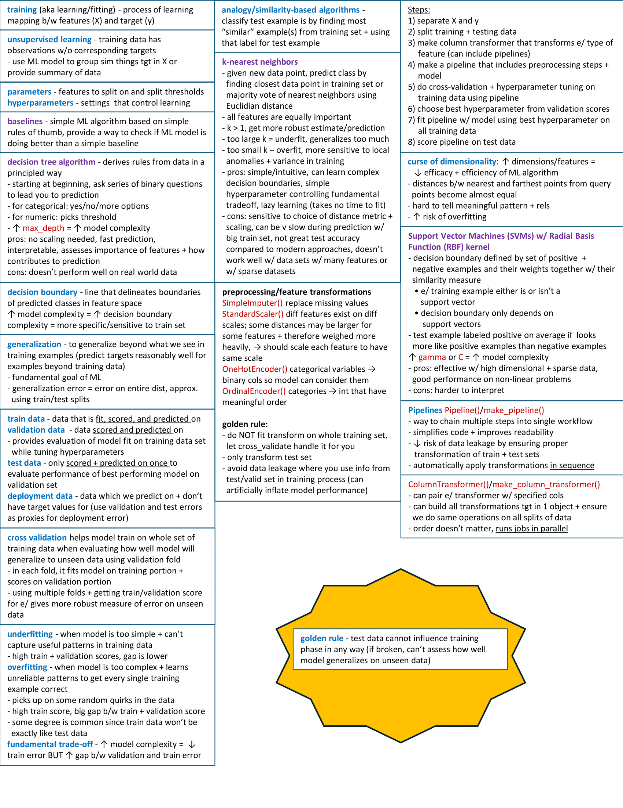
